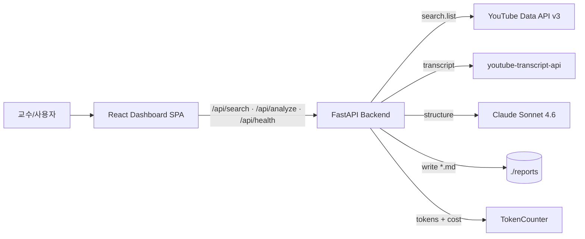
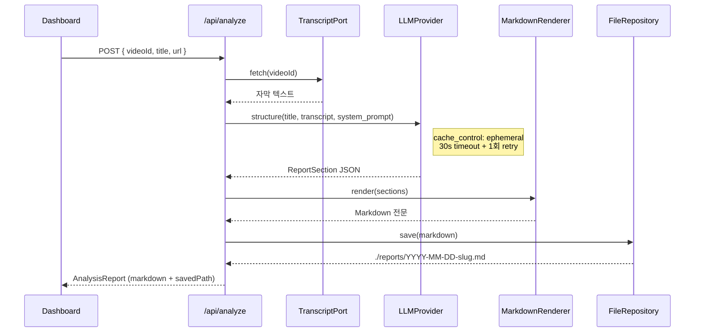

# TechReport from YouTube

[](https://github.com/ischung/techreport-from-utube/actions/workflows/lint.yml)
[](https://github.com/ischung/techreport-from-utube/actions/workflows/test.yml)
[](https://github.com/ischung/techreport-from-utube/actions/workflows/e2e.yml)
[](https://github.com/ischung/techreport-from-utube/actions/workflows/security.yml)

키워드 한 줄로 최근 1개월 YouTube 영상 5개를 찾아, 선택한 1편을 분석해 **한국어 기술보고서(마크다운)** 를 자동 생성하는 로컬 웹 대시보드입니다. 한성대 소프트웨어공학과 강의 데모 및 SDLC 실습 교재로 사용됩니다.

## 3분만에 시작하기

```bash
git clone https://github.com/ischung/techreport-from-utube.git && cd techreport-from-utube
cp .env.example .env          # ANTHROPIC_API_KEY · YOUTUBE_API_KEY 채우기
docker compose up -d          # frontend:80 + backend:8000 동시 기동
open http://localhost          # 브라우저에서 대시보드 오픈
```

API 키 없이 구조만 확인하고 싶으면 `.env` 를 비워두세요. `/api/health` 는 그대로 응답합니다 (실제 검색·분석만 실패).

### 또는 로컬 dev 모드로

```bash
# 두 개의 터미널에서 각각
uv --directory backend run uvicorn app.main:app --reload     # http://localhost:8000
pnpm --dir frontend dev                                      # http://localhost:5173
```

---

## Monorepo 구조

```
.
├── frontend/                    # React 18 + TypeScript + Vite + Tailwind
│   ├── src/                     # UI 컴포넌트 · Zustand 스토어 · API 클라이언트
│   └── tests/                   # Vitest 단위 · Playwright E2E + axe-core
├── backend/                     # FastAPI + uv + Pydantic + anthropic SDK
│   ├── app/
│   │   ├── api/                 # Routes (health · search · analyze)
│   │   ├── services/            # SearchService (LRU cache)
│   │   ├── pipeline/            # Retrieval → Analysis → Rendering → Save
│   │   ├── ports/               # LLMProvider · YouTubeSearchPort · TranscriptPort
│   │   ├── adapters/            # Claude / OpenAI / Ollama / YouTube / Transcript
│   │   ├── repository/          # FileRepository (./reports/*.md 저장)
│   │   └── observability/       # TokenCounter (누적 사용량 + 비용)
│   └── tests/                   # pytest
├── .github/workflows/           # lint · test · e2e · deploy-staging · security
├── docs/                        # 강의용 교육 노트
├── scripts/smoke.sh             # compose up 후 상태 probe
├── reports/                     # 생성된 기술보고서(.md) — git 제외
├── prd.md · techspec.md · issues-vertical.md  # SDLC 산출물
├── CHANGELOG.md                 # 릴리즈 노트
├── CLAUDE.md                    # Claude Code 작업 규칙
└── docker-compose.yml · Dockerfile × 2 · .pre-commit-config.yaml
```

---

## 아키텍처 한눈에



### 분석 파이프라인 (Retrieval → Analysis → Rendering → Save)



---

## Provider 교체 실습 (학생 과제)

`LLMProvider` 는 **Port-Adapter 패턴**으로 구현되어 `.env` 의 `LLM_PROVIDER` 값 한 줄로 `claude` (기본) · `openai` · `ollama` 를 교체할 수 있습니다. 이것은 **Clean Architecture 의 의존성 역전 원칙(DIP)** 을 실물로 관찰할 수 있는 강의 실습 소재입니다.

### 실습 절차 — OpenAI 어댑터 완성하기

1. **`.env` 수정**:
   ```bash
   LLM_PROVIDER=openai
   OPENAI_API_KEY=sk-...
   ```

2. **[`backend/app/adapters/openai_adapter.py`](./backend/app/adapters/openai_adapter.py) 의 3개 TODO 를 채웁니다**:
   - TODO 1: `openai.AsyncOpenAI` 클라이언트 생성
   - TODO 2: `chat.completions.create` 호출 (system + user, `response_format={"type": "json_object"}`)
   - TODO 3: 응답 JSON 을 `ReportSection` 으로 매핑

3. **검증**: `docker compose restart backend && open http://localhost` — 코드는 한 줄도 건드리지 않았는데 provider가 바뀝니다. `/api/health` 응답의 `llmProvider` 필드가 `"openai"` 로 바뀌었는지 확인.

4. **토론 질문**: 이 구조에서 `AnalysisPipeline` 은 OpenAI를 알까요? `anthropic` SDK 와 `openai` SDK 는 서로의 존재를 알까요? 이것이 **DIP(Dependency Inversion Principle)** 의 핵심입니다.

### Ollama (로컬 무료 LLM) 실습

1. `brew install ollama && ollama serve &`
2. `ollama pull qwen2.5` (또는 llama3.1, exaone 등)
3. `.env` 에서 `LLM_PROVIDER=ollama`
4. [`backend/app/adapters/ollama_adapter.py`](./backend/app/adapters/ollama_adapter.py) 의 TODO 채우기
5. 네트워크·비용 없이 완전 오프라인 데모 가능

---

## 비용 관리

### 실제 호출 비용 (Claude Sonnet 4.6, 2026-04 기준)

| 단가 | $3 / MTok (input) | $15 / MTok (output) | $0.30 / MTok (cache read) |

**10~30분 영상 1편 분석 실측**:
- Input: ~7,000 tok (프롬프트 캐시 적용 시 중복 6,000 tok 은 10% 단가로)
- Output: ~3,000 tok
- **약 $0.05 / 편** (월 100편 = 약 $5)

### 런타임 확인

사이드바 Footer 의 `spend: $0.xxxx · N,NNN tok` 배지에 프로세스 누적 사용량이 표시됩니다. `/api/health` 응답에서도 확인 가능:

```bash
curl -s http://localhost:8000/api/health | jq .data
# {
#   "status": "up",
#   "llmProvider": "claude",
#   "tokensInput": 7234,
#   "tokensOutput": 2841,
#   "estimatedCostUsd": 0.0643
# }
```

> 프로세스 재기동 시 0으로 초기화됩니다 (학기 전체 누적이 필요하면 v1.1 에서 SQLite 지속 저장 추가 예정).

---

## 개발 가이드

| 작업 | 명령 |
|------|------|
| 린트 | `pnpm --dir frontend lint` · `cd backend && ruff check .` |
| 포맷 | `pnpm --dir frontend format` · `cd backend && ruff format .` |
| 단위 테스트 | `pnpm --dir frontend test` · `cd backend && pytest` |
| E2E | `pnpm --dir frontend test:e2e` (compose 스택 필요) |
| 타입체크 | `pnpm --dir frontend typecheck` |
| 보안 스캔 | CI에서 자동 (bandit + pip-audit + biome + pnpm audit) |
| pre-commit | `pipx install pre-commit && pre-commit install` |

---

## 문서

| 파일 | 단계 | 설명 |
|------|------|------|
| [`prd.md`](./prd.md) | Phase 1 | 제품 요구사항 (What/Why) |
| [`techspec.md`](./techspec.md) | Phase 2 | 기술 명세 (How) — Port-Adapter + Pipeline |
| [`issues-vertical.md`](./issues-vertical.md) | Phase 3 | 이슈 분할 (20개 CI-1~CI-20) |
| [`docs/education-notes.md`](./docs/education-notes.md) | 강의 | DIP · Hexagonal · Walking Skeleton 핵심 정리 |
| [`CHANGELOG.md`](./CHANGELOG.md) | — | 릴리즈 노트 |
| [`CONTRIBUTING.md`](./CONTRIBUTING.md) | — | 브랜치 · 커밋 · PR 규칙 |
| [`CLAUDE.md`](./CLAUDE.md) | — | Claude Code 작업 규칙 |

---

## 라이선스

MIT © Insang Cho (insang@hansung.ac.kr)
