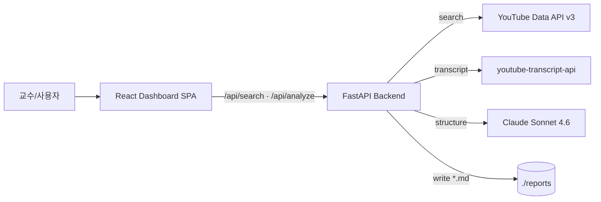

# TechReport from YouTube

[](https://github.com/ischung/techreport-from-utube/actions/workflows/lint.yml)
[](https://github.com/ischung/techreport-from-utube/actions/workflows/test.yml)

키워드 한 줄로 최근 1개월 YouTube 영상 5개를 찾아, 선택한 1편을 분석해 **한국어 기술보고서(마크다운)** 를 자동 생성하는 로컬 웹 대시보드입니다. 한성대 소프트웨어공학과 강의 데모 및 SDLC 실습 교재로 사용됩니다.

## 3분만에 시작하기

```bash
git clone https://github.com/ischung/techreport-from-utube.git && cd techreport-from-utube
cp .env.example .env          # ANTHROPIC_API_KEY · YOUTUBE_API_KEY 채우기
pnpm --dir frontend install && uv --directory backend sync   # 의존성 설치
```

그다음:

```bash
# 두 개의 터미널에서 각각
uv --directory backend run uvicorn app.main:app --reload     # http://localhost:8000
pnpm --dir frontend dev                                      # http://localhost:5173
```

## Monorepo 구조

```
.
├── frontend/            # React 18 + TypeScript + Vite + Tailwind + shadcn/ui
│   ├── src/             # UI 컴포넌트 · 상태 · API 클라이언트
│   └── tests/           # Vitest 단위 · Playwright E2E
├── backend/             # FastAPI + uv + Pydantic + anthropic SDK
│   ├── app/             # Routes · Services · Pipeline · Ports · Adapters
│   └── tests/           # pytest
├── reports/             # 생성된 기술보고서(.md) — git 제외
├── prd.md               # 제품 요구 문서 (PRD)
├── techspec.md          # 기술 명세 (Port-Adapter + Pipeline)
├── issues-vertical.md   # 이슈 분할 (Vertical Slice + CI/CD-first)
└── .pre-commit-config.yaml
```

## 아키텍처 한눈에



`LLMProvider` 는 **Port-Adapter 패턴**으로 구현되어 `.env` 의 `LLM_PROVIDER` 값 한 줄로 `claude` / `openai` / `ollama` 를 교체할 수 있습니다. Clean Architecture 의존성 역전 원칙(DIP)을 실물로 관찰할 수 있는 강의 실습 소재입니다.

## 개발 가이드

- **린트**: `pnpm --dir frontend lint` · `cd backend && ruff check .`
- **테스트**: `pnpm --dir frontend test` · `cd backend && pytest`
- **E2E**: `pnpm --dir frontend test:e2e`
- **pre-commit 설치**: `pipx install pre-commit && pre-commit install`

## 문서

| 파일 | 단계 | 설명 |
|------|------|------|
| [`prd.md`](./prd.md) | Phase 1 | 제품 요구사항 (What/Why) |
| [`techspec.md`](./techspec.md) | Phase 2 | 기술 명세 (How) |
| [`issues-vertical.md`](./issues-vertical.md) | Phase 3 | 이슈 분할 (20개 CI-1~CI-20) |

## 라이선스

MIT © Insang Cho (insang@hansung.ac.kr)
