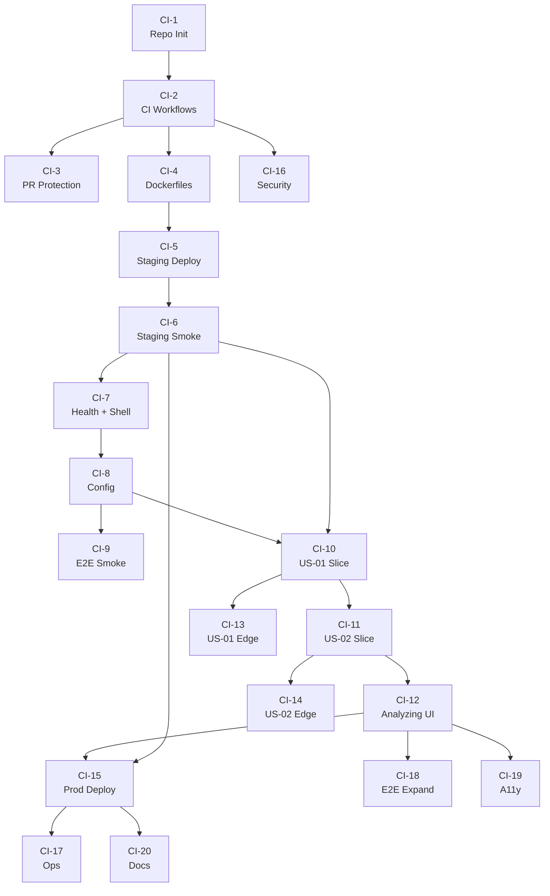

# Issues — TechReport from YouTube (Vertical Slice + CI/CD-first)

> **원본 TechSpec**: [`./techspec.md`](./techspec.md) v0.1
> **원본 PRD**: [`./prd.md`](./prd.md) v0.2
> **생성일**: 2026-04-23
> **분할 전략**: Vertical Slice + CI/CD-first (Walking Skeleton → MVP)
> **생성 스킬**: `generate-issues-vertical` v3.0
> **출력 파일**: `issues-vertical.md`
> **형제 파일(참고)**: `issues-layered.md` — 계층별 분할 결과 전용
> **총 이슈 수**: 20개
> **Phase 구성**: 0-A [3] · 0-B [3] · 0-C [3] · 1 [3] · 2 [2] · 3 [6]
> **총 예상 소요**: 약 15.5일 (병렬 실행 시 8일 마일스톤 내 달성 가능)
> **의존성 간선 수**: 26, 사이클 없음
> **가장 빠른 CI/CD 도달**: CI-1 → CI-2 → CI-4 → CI-5 → CI-6 (staging smoke 통과) = 누적 약 3일

---

## 📊 CoT 분석 요약

### 🔍 프로젝트 도메인
YouTube 영상 → 한국어 기술보고서 자동 생성 (단일 사용자 로컬 웹 대시보드)

### 🧭 관통 경로 (Thinnest E2E)
```
[React SPA 키워드 입력]
     │  POST /api/search
     ▼
[FastAPI Routes → SearchService → YouTubeDataAdapter]
     │  YouTube Data API v3 (publishedAfter=1m, maxResults=5)
     ▼
[VideoList 5개 렌더] → [사용자 1편 선택]
     │  POST /api/analyze
     ▼
[AnalysisPipeline: Transcript → LLMProvider(Claude) → Markdown → FileRepository]
     │
     ▼
[./reports/YYYY-MM-DD-slug.md 저장 + UI 미리보기]
```

### 🎯 Walking Skeleton 정의
"스테이징(docker compose) 에서 `/api/health` 가 응답하고 React Dashboard 가 해당 상태를 표시한다"

### 📊 유저 스토리 (PRD §3 기준)
- **P0 US-01**: 교수는 키워드를 입력하여 최근 1개월 이내 YouTube 영상 5개를 목록으로 확인한다
- **P0 US-02**: 교수는 5개 중 1편을 선택하여, 한국어 기술보고서(마크다운)를 받는다

### 🛠️ 기술 스택
- **Frontend**: React 18 + TypeScript + Vite + Tailwind + shadcn/ui + Zustand
- **Backend**: FastAPI (Python 3.11+) + uv + Pydantic + anthropic SDK
- **LLM**: Port-Adapter — ClaudeAdapter(default) / OpenAIAdapter / OllamaAdapter(stub)
- **External**: YouTube Data API v3, youtube-transcript-api
- **Storage**: 로컬 FS (`./reports/*.md`) — DB 없음
- **CI**: GitHub Actions (`lint.yml`, `test.yml`, `e2e.yml`, `kanban.yml`)
- **CD 타겟** (기본값):
  - **staging**: GitHub Actions runner 내 `docker compose up` → smoke
  - **prod**: Fly.io (backend) + Vercel (frontend static) — 수동 승인 게이트

### 🛡️ 필수 게이트
lint · unit-test · E2E-smoke · SAST(bandit+ESLint security) · 의존성 취약점 스캔

### 🌐 Cross-cutting
관측성(에러 로그 + 토큰 카운터) · 접근성(WCAG AA 다크모드) · 문서

---

## 📜 권장 실행 순서 (위상 정렬)

| order | 임시ID | 레이블 | 제목 | 예상 |
|:------|:-------|:--------|:-----|:-----|
| 001 | CI-1  | `[CI]` `priority:p0` | 저장소 초기화 + Monorepo 스캐폴딩 + lint/format + pre-commit | 0.5일 |
| 002 | CI-2  | `[CI]` `priority:p0` | GitHub Actions 기본 워크플로 (lint + unit test) | 0.5일 |
| 003 | CI-3  | `[CI]` `priority:p0` `mandatory-gate` | PR 보호 규칙 + 상태 배지 + KANBAN_TOKEN runtime-guard | 0.5일 |
| 004 | CI-4  | `[CD]` `profile:staging` `priority:p0` | Dockerfile × 2 + docker-compose.yml + 환경변수 설계 | 0.5일 |
| 005 | CI-5  | `[CD]` `profile:staging` `priority:p0` | main 머지 → 이미지 빌드 + compose up 스테이징 자동 배포 | 1일 |
| 006 | CI-6  | `[CD]` `profile:staging` `priority:p0` `mandatory-gate` | 스테이징 배포 후 smoke test 자동 수행 | 0.5일 |
| 007 | CI-7  | `[Skeleton]` `priority:p0` | `/api/health` + React `AppShell` "Hello Dashboard" | 1일 |
| 008 | CI-8  | `[Skeleton]` `priority:p0` | Config 로딩 + `.env.example` + LLM Provider 선택 스텁 | 0.5일 |
| 009 | CI-9  | `[Skeleton]` `priority:p1` | Playwright E2E 1건 — "Dashboard 로드 + health 표시" | 0.5일 |
| 010 | CI-16 | `[Security]` `priority:p0` `mandatory-gate` | SAST(bandit + ESLint security) + 의존성 취약점 스캔 | 0.5일 |
| 011 | CI-10 | `[Slice]` `priority:p1` | **US-01** 키워드 입력 → 최근 1개월 영상 5개 표시 (Happy Path) | 2일 |
| 012 | CI-11 | `[Slice]` `priority:p1` | **US-02** 영상 선택 → 한국어 기술보고서 생성·저장 (Happy Path) | 2일 |
| 013 | CI-12 | `[Slice]` `priority:p1` | 분석 진행 UI (AnalyzingView + LogStream + Progress) | 1일 |
| 014 | CI-13 | `[Slice]` `priority:p2` | US-01 엣지 케이스 — 검색 0건 / 네트워크 오류 | 0.5일 |
| 015 | CI-14 | `[Slice]` `priority:p2` | US-02 엣지 케이스 — 자막 없음 / LLM 타임아웃 | 0.5일 |
| 016 | CI-18 | `[QA]` `priority:p2` | E2E 시나리오 3건 확장 (성공 / 자막 없음 / 검색 0건) | 1일 |
| 017 | CI-19 | `[A11y]` `priority:p2` | 다크 모드 WCAG AA 대비율 검토 + 키보드 네비 개선 | 1일 |
| 018 | CI-15 | `[CD]` `profile:prod` `priority:p0` `mandatory-gate` | 프로덕션 배포 파이프라인 (Fly.io + Vercel) + 수동 승인 | 1일 |
| 019 | CI-17 | `[Ops]` `priority:p1` | 에러 로깅 + Claude 토큰 누적 카운터 (`/api/health` 노출) | 0.5일 |
| 020 | CI-20 | `[Docs]` `priority:p2` | README 실행 가이드 + Provider 교체 실습 섹션 + 릴리즈 노트 | 0.5일 |

---

## 🔗 의존성 그래프



```text
CI-1 ─► CI-2 ─► CI-3
         │
         ├─► CI-4 ─► CI-5 ─► CI-6 ─► CI-7 ─► CI-8 ─► CI-9
         │                      │       │
         │                      │       └─► CI-10 ─► CI-11 ─► CI-12 ─┬─► CI-15 ─┬─► CI-17
         │                      │                 │        │          │          └─► CI-20
         │                      │                 │        ├─► CI-18
         │                      │                 │        └─► CI-19
         │                      │                 └─► CI-13
         │                      │                          CI-11 ─► CI-14
         │                      └────────────────────────────────► CI-15 (직접도)
         └─► CI-16 (Security — 병렬 가능)
```

---

## Phase 0-A · CI 부트스트랩

### #1 [CI] 저장소 초기화 + Monorepo 스캐폴딩 + lint/format + pre-commit

**GitHub Issue**: #1 → https://github.com/ischung/techreport-from-utube/issues/1

**레이블**: `[CI]`
**공통 레이블**: `strategy:vertical-slice`, `priority:p0`, `order:001`, `phase-0a-ci`
**Phase**: 0-A CI 부트스트랩
**연관 US**: 없음
**예상 소요**: 0.5일
**Depends on**: 없음
**Required by**: #2
**분할 전략**: Vertical Slice + CI/CD-first
**출력 파일**: `issues-vertical.md`

#### 배경
어떤 기능 구현보다도 먼저 "변경이 들어오면 자동으로 린트/포맷이 돈다"는 최소 품질 가드를 만들어야 한다. 교수님 CLAUDE.md의 "Git Flow · CI/CD 자동화" 정책에 따라, 최상위에 monorepo 구조(`/frontend`, `/backend`)와 언어별 린터(`ruff`, `biome`)를 정비한다.

#### 구현 범위
- [ ] **UI**: 해당 없음
- [ ] **API**: 해당 없음
- [ ] **DB**: 해당 없음
- [ ] **CI/CD**: `.git`, `.gitignore`, `.editorconfig`, `README.md`, `package.json` (workspace root), `pyproject.toml` (root optional), `.pre-commit-config.yaml`
- [ ] **유효성·권한**: N/A
- [ ] **테스트**: `pre-commit run --all-files` 로컬 수동 검증
- [ ] **배포**: N/A (Phase 0-B에서 이어짐)

#### 수락 기준
- [ ] `/frontend` 에 Vite + React + TS + Tailwind 스캐폴딩 완료 (`pnpm create vite` 결과물)
- [ ] `/backend` 에 `uv init` + FastAPI + Uvicorn 의존성 잠금 완료
- [ ] `ruff check .` 과 `biome check .` 이 둘 다 0 에러로 종료
- [ ] `pre-commit install` 후 `git commit` 시 자동 실행 확인
- [ ] `.gitignore` 에 `node_modules/`, `__pycache__/`, `.venv/`, `.env`, `reports/` 포함
- [ ] README 최상단에 "monorepo 구조 + 실행 방법 (3줄)" 안내

#### 참고
- TechSpec 섹션: §3 기술 스택 · §8 Phase 1
- 교수님 CLAUDE.md: "Git Flow · CI/CD · 문서화" 정책

---

### #2 [CI] GitHub Actions 기본 워크플로 (lint + unit test)

**GitHub Issue**: #2 → https://github.com/ischung/techreport-from-utube/issues/2

**레이블**: `[CI]`
**공통 레이블**: `strategy:vertical-slice`, `priority:p0`, `order:002`, `phase-0a-ci`
**Phase**: 0-A CI 부트스트랩
**연관 US**: 없음
**예상 소요**: 0.5일
**Depends on**: #1
**Required by**: #3, #4, #10

#### 배경
PR 이 열리면 자동으로 린트와 단위 테스트가 돌아야 한다. 교수님 정책상 `KANBAN_TOKEN` 미등록 환경에서도 빨간 X가 뜨지 않는 **runtime-guard 패턴**을 일관 적용한다.

#### 구현 범위
- [ ] **UI**: 해당 없음
- [ ] **API**: 해당 없음
- [ ] **DB**: 해당 없음
- [ ] **CI/CD**:
  - `.github/workflows/lint.yml` — ruff + biome on PR/push
  - `.github/workflows/test.yml` — pytest + vitest on PR/push (빈 테스트라도 green)
  - `KANBAN_TOKEN` 은 `required: false` + runtime guard (`if: secrets.KANBAN_TOKEN != ''`)
- [ ] **테스트**: dummy test 1개 (frontend/backend 각각) — 워크플로 green 검증용

#### 수락 기준
- [ ] PR 생성 시 lint + test 워크플로가 자동 트리거
- [ ] 두 워크플로 모두 초록불로 통과
- [ ] KANBAN_TOKEN 없는 fork 환경에서도 실패 없이 skip
- [ ] 워크플로 실행 시간 3분 이내

#### 참고
- TechSpec 섹션: §3-3 공통 · §8 Phase 1
- 교수님 CLAUDE.md: "KANBAN_TOKEN runtime-guard 패턴"

---

### #3 [CI] PR 보호 규칙 + 상태 배지 + KANBAN_TOKEN runtime-guard

**GitHub Issue**: #3 → https://github.com/ischung/techreport-from-utube/issues/3

**레이블**: `[CI]`, `mandatory-gate`
**공통 레이블**: `strategy:vertical-slice`, `priority:p0`, `order:003`, `phase-0a-ci`, `mandatory-gate`
**Phase**: 0-A CI 부트스트랩
**예상 소요**: 0.5일
**Depends on**: #2
**Required by**: (없음 — leaf)

#### 배경
CI는 있지만 통과 여부가 머지를 막지 않는다면 장식에 불과하다. main 브랜치에 보호 규칙을 걸어 `lint.yml` + `test.yml` 이 모두 green 일 때만 머지 허용. README에 상태 배지를 부착해 한눈에 상태 파악.

#### 구현 범위
- [ ] **CI/CD**:
  - main 브랜치 보호 규칙 (require status checks: `lint`, `test` / require PR review: 1인)
  - README 상단에 배지 2개 (lint + test)
  - `CONTRIBUTING.md` 기본 템플릿 (1 페이지)
- [ ] **테스트**: 빨간 PR 1건을 일부러 만들어 "머지 차단" 확인 후 닫기

#### 수락 기준
- [ ] main 브랜치에 직접 push 금지 설정
- [ ] 실패한 lint PR 은 머지 버튼이 비활성화됨
- [ ] README 배지가 최신 상태로 렌더링됨

---

## Phase 0-B · CD 스테이징

### #4 [CD] Dockerfiles × 2 + docker-compose.yml + 환경변수 설계

**GitHub Issue**: #4 → https://github.com/ischung/techreport-from-utube/issues/4

**레이블**: `[CD]`, `profile:staging`
**공통 레이블**: `strategy:vertical-slice`, `priority:p0`, `order:004`, `phase-0b-cd`, `profile:staging`
**Phase**: 0-B CD 스테이징
**예상 소요**: 0.5일
**Depends on**: #2
**Required by**: #5

#### 배경
"로컬 스테이징"을 재현 가능한 단위로 만들기 위해 frontend/backend 각각 Dockerfile + 하나의 docker-compose.yml 로 묶는다. 환경변수 스키마(`.env.example`)는 여기서 확정해 이후 이슈에서 일관 사용.

#### 구현 범위
- [ ] **CI/CD**:
  - `/frontend/Dockerfile` (Node 20 Alpine, multi-stage, `nginx:alpine` 서빙)
  - `/backend/Dockerfile` (Python 3.11-slim + uv, uvicorn 실행)
  - `/docker-compose.yml` (frontend:80, backend:8000, `depends_on`)
  - `/.env.example` (LLM_PROVIDER, ANTHROPIC_API_KEY, YOUTUBE_API_KEY, REPORTS_DIR …)
  - `/backend/app/config.py` (Pydantic Settings, `.env` 로드)

#### 수락 기준
- [ ] `docker compose build` 성공 (10분 이내)
- [ ] `docker compose up -d` 후 frontend:80 접속 시 Vite 인덱스 로드
- [ ] backend:8000/api/health 가 503 이상으로라도 응답 (아직 health 엔드포인트 미구현이어도 Uvicorn은 떠있음)
- [ ] `.env.example` 에 모든 필수 키 + 주석 포함

#### 참고
- TechSpec 섹션: §6-2 Backend (환경변수 섹션)

---

### #5 [CD] main 머지 → 이미지 빌드 + compose up 스테이징 자동 배포

**GitHub Issue**: #5 → https://github.com/ischung/techreport-from-utube/issues/5

**레이블**: `[CD]`, `profile:staging`
**공통 레이블**: `strategy:vertical-slice`, `priority:p0`, `order:005`, `phase-0b-cd`, `profile:staging`
**Phase**: 0-B CD 스테이징
**예상 소요**: 1일
**Depends on**: #4
**Required by**: #6

#### 배경
main 에 머지되면 GitHub Actions 러너 내에서 이미지 빌드 → `docker compose up` 으로 "로컬 스테이징"을 띄운다. 교육·데모용으로는 이 수준이 충분하며, Fly.io/Vercel 등 외부 CD는 Phase 3(CI-15)에서 덧붙인다.

#### 구현 범위
- [ ] **CI/CD**:
  - `.github/workflows/deploy-staging.yml` — main push 트리거
  - 이미지 빌드 캐시 (GitHub Actions Cache)
  - `docker compose up -d` + `sleep 10` + health probe
  - 실패 시 `docker compose logs` 아티팩트 업로드

#### 수락 기준
- [ ] main 머지 시 워크플로 자동 실행
- [ ] 10분 이내에 compose 기동 완료
- [ ] 실패 시 Slack/Email 알림 대신 Actions 실패 배지로 알림 (v0.1은 간단히)

---

### #6 [CD] 스테이징 배포 후 smoke test 자동 수행

**GitHub Issue**: #6 → https://github.com/ischung/techreport-from-utube/issues/6

**레이블**: `[CD]`, `profile:staging`, `mandatory-gate`
**공통 레이블**: `strategy:vertical-slice`, `priority:p0`, `order:006`, `phase-0b-cd`, `profile:staging`, `mandatory-gate`
**Phase**: 0-B CD 스테이징
**예상 소요**: 0.5일
**Depends on**: #5
**Required by**: #7, #11, #18

#### 배경
배포가 됐다고 작동을 보장하지는 않는다. 최소한 `/api/health` 200 응답과 프론트 인덱스 200 응답을 smoke 로 확인해, 초록불 파이프라인이 "실제로 올라간 스테이징"을 가리키도록 만든다. 이 이슈가 `mandatory-gate` 로 지정되는 이유는 이후 모든 슬라이스의 DoD가 "스테이징에서 smoke 통과"이기 때문.

#### 구현 범위
- [ ] **CI/CD**:
  - `/scripts/smoke.sh` — curl + 기대 상태코드 체크
  - `deploy-staging.yml` 의 마지막 단계에 `scripts/smoke.sh` 실행
  - 실패 시 즉시 `docker compose down` 후 job fail

#### 수락 기준
- [ ] 정상 배포 후 smoke 단계가 녹색으로 종료
- [ ] 의도적으로 backend 를 깨뜨린 PR 은 smoke 단계에서 실패 (머지 차단)

---

## Phase 0-C · Walking Skeleton

### #7 [Skeleton] `/api/health` + React `AppShell` "Hello Dashboard"

**GitHub Issue**: #7 → https://github.com/ischung/techreport-from-utube/issues/7

**레이블**: `[Skeleton]`
**공통 레이블**: `strategy:vertical-slice`, `priority:p0`, `order:007`, `phase-0c-skeleton`
**Phase**: 0-C Walking Skeleton
**예상 소요**: 1일
**Depends on**: #6
**Required by**: #8

#### 배경
"초록불 파이프라인 + 배포된 환경" 위에 올릴 첫 E2E 뼈대. 교수님 선호(다크 대시보드 풍)의 AppShell(사이드바 + 메인 + 상태 도트)이 스테이징에서 backend `/api/health` 응답을 가져와 표시하면 Walking Skeleton 달성.

#### 구현 범위
- [ ] **UI**: `AppShell`, `Sidebar`, `BrandMark`, `StatusDot`, `DashboardHeader` 5개 컴포넌트 (shadcn/ui 기반)
- [ ] **API**: `GET /api/health` — `{ ok: true, data: { status: "up", llmProvider: "claude", version: "0.1.0" } }`
- [ ] **DB**: 해당 없음
- [ ] **CI/CD**: 기존 워크플로 재사용
- [ ] **테스트**:
  - backend 단위: `test_health.py` — 200 응답 + 스키마 검증
  - frontend 단위: `AppShell.test.tsx` — 렌더 + 상태 도트 색
- [ ] **배포**: CI-6 smoke 가 `/api/health` 200 + 프론트 "TechReport" 문자열 포함 검증

#### 수락 기준
- [ ] 스테이징 URL 접속 시 다크 대시보드 AppShell 렌더
- [ ] 사이드바 Footer에 버전 + 상태 도트(emerald = up) 표시
- [ ] `/api/health` 응답이 3초 이내
- [ ] 단위 테스트 frontend/backend 각 1건 이상 통과

#### 참고
- TechSpec §6-1 컴포넌트 트리 · §7-3 공통 컴포넌트

---

### #8 [Skeleton] Config 로딩 + `.env.example` + LLM Provider 선택 스텁

**GitHub Issue**: #8 → https://github.com/ischung/techreport-from-utube/issues/8

**레이블**: `[Skeleton]`
**공통 레이블**: `strategy:vertical-slice`, `priority:p0`, `order:008`, `phase-0c-skeleton`
**Phase**: 0-C Walking Skeleton
**예상 소요**: 0.5일
**Depends on**: #7
**Required by**: #9, #11

#### 배경
기능 슬라이스(CI-10) 들어가기 직전에 환경변수 스키마 + LLM Provider 추상화의 **뼈대**를 세운다. 실제 구현은 CI-11 에서. 지금은 `LLMProvider` 추상 클래스 + `ClaudeAdapter` 더미(NotImplementedError 또는 고정 응답) + `get_llm_provider()` DI 함수까지.

#### 구현 범위
- [ ] **API**: 해당 없음 (내부 구조)
- [ ] **Backend**:
  - `app/config.py` Pydantic Settings 확정
  - `app/ports/llm_provider.py` 추상 클래스
  - `app/adapters/claude_adapter.py` 뼈대 (생성자만, `structure`는 `NotImplementedError`)
  - `app/adapters/openai_adapter.py`, `ollama_adapter.py` — 학생 실습용 TODO 주석 포함 스텁
  - `app/deps.py` — `get_llm_provider()` match 문
- [ ] **테스트**:
  - `test_config.py` — `.env` 로드 + 필수 키 누락 시 예외
  - `test_llm_provider_selection.py` — `LLM_PROVIDER=claude/openai/ollama` 각각에 대해 올바른 어댑터가 반환되는지

#### 수락 기준
- [ ] 환경변수 누락 시 서버 부팅 실패 + 친절한 에러 메시지
- [ ] `/api/health` 응답의 `llmProvider` 필드가 `.env` 값에 따라 변화
- [ ] Provider 스텁 파일에 `# TODO(학생 실습)` 주석 포함

---

### #9 [Skeleton] Playwright E2E 1건 — "Dashboard 로드 + health 표시"

**GitHub Issue**: #9 → https://github.com/ischung/techreport-from-utube/issues/9

**레이블**: `[Skeleton]`
**공통 레이블**: `strategy:vertical-slice`, `priority:p1`, `order:009`, `phase-0c-skeleton`
**Phase**: 0-C Walking Skeleton
**예상 소요**: 0.5일
**Depends on**: #8
**Required by**: (없음 — leaf, CI-18에서 확장)

#### 배경
UI→API→Config 관통이 Playwright E2E 1건으로 보증되면 이후 슬라이스 추가 시 회귀를 감지할 수 있다. CI에서 compose 스테이징을 띄우고 Playwright 가 실제 브라우저로 접속.

#### 구현 범위
- [ ] **CI/CD**:
  - `.github/workflows/e2e.yml` — compose up + `pnpm playwright test`
  - `tests/e2e/smoke.spec.ts` 1건
- [ ] **테스트**: "페이지가 'TechReport'를 포함하고, 상태 도트 색이 emerald 이다"

#### 수락 기준
- [ ] CI에서 E2E 워크플로 5분 이내 완료
- [ ] 로컬에서도 `pnpm playwright test` 실행 가능

---

## Phase 3 (Early) · Security — Phase 0-A 병렬

### #10 [Security] SAST + 의존성 취약점 스캔

**GitHub Issue**: #10 → https://github.com/ischung/techreport-from-utube/issues/10

**레이블**: `[Security]`, `mandatory-gate`
**공통 레이블**: `strategy:vertical-slice`, `priority:p0`, `order:010`, `phase-3-ops`, `mandatory-gate`
**Phase**: 3 운영화 (단, Phase 0-A 완료 직후부터 병렬 실행 권장)
**예상 소요**: 0.5일
**Depends on**: #2
**Required by**: (없음 — leaf)

#### 배경
보안 게이트를 늦게 추가하면 축적된 취약점이 폭탄이 된다. CI 기반이 마련된 직후(#2) 바로 SAST + 의존성 스캔을 붙여 P0로 둔다. `priority:p0 + mandatory-gate` 조합으로 PR 머지 차단.

#### 구현 범위
- [ ] **CI/CD**:
  - `.github/workflows/security.yml`
  - Backend: `bandit -r backend/` + `pip-audit`
  - Frontend: `biome check --apply=false` + `pnpm audit --prod`
  - 결과가 High 이상이면 job 실패

#### 수락 기준
- [ ] PR 마다 자동 실행
- [ ] High 취약점 발견 시 머지 차단
- [ ] 스캔 시간 2분 이내

---

## Phase 1 · Core MVP (P0 수직 슬라이스)

### #11 [Slice] US-01 키워드 입력 → 최근 1개월 영상 5개 표시 (Happy Path)

**GitHub Issue**: #11 → https://github.com/ischung/techreport-from-utube/issues/11

**레이블**: `[Slice]`
**공통 레이블**: `strategy:vertical-slice`, `priority:p1`, `order:011`, `phase-1-mvp`
**Phase**: 1 Core MVP
**연관 US**: US-01
**예상 소요**: 2일
**Depends on**: #8, #6
**Required by**: #12, #14

#### 배경
PRD P0 유저 스토리 1을 처음부터 끝까지(End-to-End) 구현하는 첫 수직 슬라이스. UI(KeywordInputView → VideoListView) + API(`/api/search`) + Adapter(YouTube Data v3) + 테스트까지 함께 포함. 스테이징에서 실제 검색이 동작해야 DoD.

#### 구현 범위
- [ ] **UI**:
  - `KeywordInputView` (shadcn `Input` + `Button`, 엔터 트리거)
  - `VideoListView` — `VideoCard × 5` (제목, 업로드일, 채널)
  - Zustand store: `keyword`, `videos`, `phase` 전이
- [ ] **API**:
  - `POST /api/search` — Pydantic 요청 검증 (`keyword: str, min=2, max=100`)
  - `VideoSearchResult[]` 응답
- [ ] **Backend**:
  - `app/ports/youtube_search_port.py` 추상
  - `app/adapters/youtube_data_adapter.py` — `google-api-python-client` 사용, `publishedAfter` = now−30일
  - `app/services/search_service.py` + LRU 캐시 (5분)
- [ ] **DB**: 해당 없음
- [ ] **CI/CD**: 기존 워크플로 재사용 + `YOUTUBE_API_KEY` GitHub Secret 주입
- [ ] **테스트**:
  - Backend 단위: `test_youtube_adapter.py` (`respx` mock) — 정상 응답 파싱, `publishedAfter` 계산, 5개로 cap
  - Backend 통합: `test_search_route.py` — 200 + 스키마
  - Frontend 단위: `KeywordInputView.test.tsx`, `VideoCard.test.tsx`
- [ ] **배포**: 스테이징 smoke에 "키워드 'react' 검색 시 5개 카드 렌더" 시나리오 1건 추가

#### 수락 기준
- [ ] 사용자가 키워드 2자 이상 입력 후 Enter → 5초 이내에 5개 카드 표시
- [ ] 업로드일은 전부 최근 1개월 이내
- [ ] 각 카드는 제목·채널·업로드일을 노출
- [ ] 키워드 1자 이하는 제출 버튼 비활성화
- [ ] 스테이징에서 동일 시나리오가 E2E로 green

#### 참고
- TechSpec §5-3 POST /api/search · §6-1 컴포넌트 트리

---

### #12 [Slice] US-02 영상 선택 → 한국어 기술보고서 생성·저장 (Happy Path)

**GitHub Issue**: #12 → https://github.com/ischung/techreport-from-utube/issues/12

**레이블**: `[Slice]`
**공통 레이블**: `strategy:vertical-slice`, `priority:p1`, `order:012`, `phase-1-mvp`
**Phase**: 1 Core MVP
**연관 US**: US-02
**예상 소요**: 2일
**Depends on**: #11
**Required by**: #13, #15

#### 배경
이 프로젝트의 심장. 자막 → LLM(Claude) 구조화 → Markdown → FS 저장까지의 Pipeline을 완성. ClaudeAdapter의 `structure()` 실구현 + Prompt Caching 적용.

#### 구현 범위
- [ ] **UI**:
  - `VideoCard` 클릭 → 분석 시작
  - 간단한 `AnalyzingView` 로딩 상태 (상세 UI는 CI-12에서)
  - `ReportResultView` — `react-markdown` + `rehype-highlight` (다크 테마)
  - "파일 경로 복사" 버튼
- [ ] **API**:
  - `POST /api/analyze` — `{ videoId, title, url }` → `AnalysisReport`
- [ ] **Backend**:
  - `app/ports/transcript_port.py` 추상 + `youtube_transcript_adapter.py`
  - `app/adapters/claude_adapter.py` 실구현 — `cache_control: ephemeral` 적용
  - `app/pipeline/analysis_pipeline.py` — Retrieval → Analysis → Rendering → Save
  - `app/pipeline/markdown_renderer.py` — `ReportSection` → 마크다운
  - `app/repository/file_repository.py` — 슬러그 생성 + 충돌 시 suffix
  - 시스템 프롬프트(`SYSTEM_PROMPT_KR`) 확정 (한국어 구조화 지시)
- [ ] **DB**: 해당 없음
- [ ] **CI/CD**: `ANTHROPIC_API_KEY` GitHub Secret 주입
- [ ] **테스트**:
  - Backend 단위: `test_claude_adapter.py` (`respx` + Anthropic API mock), `test_markdown_renderer.py`, `test_file_repository.py` (슬러그 · 충돌 suffix)
  - Backend 통합: `test_analyze_route.py` — fixture transcript 로 end-to-end
  - Frontend 단위: `ReportResultView.test.tsx`
- [ ] **배포**: 스테이징 smoke에 "analyze fixture 요청 → 200 + savedPath 반환" 추가 (실제 Claude 호출은 mock)

#### 수락 기준
- [ ] 영상 1편 선택 후 3분 이내에 보고서 마크다운 반환
- [ ] `./reports/YYYY-MM-DD-slug.md` 파일이 실제로 생성됨
- [ ] 응답 JSON의 `llmProvider` 가 `.env` 값과 일치 (예: "claude")
- [ ] 보고서 섹션 5개(개요/핵심 개념/상세/팁/참고)가 모두 존재
- [ ] Prompt caching 사용 여부가 로그로 확인됨

#### 참고
- TechSpec §5-3 POST /api/analyze · §6-2 핵심 Pipeline 구현

---

### #13 [Slice] 분석 진행 UI (AnalyzingView + LogStream + Progress)

**GitHub Issue**: #13 → https://github.com/ischung/techreport-from-utube/issues/13

**레이블**: `[Slice]`
**공통 레이블**: `strategy:vertical-slice`, `priority:p1`, `order:013`, `phase-1-mvp`
**Phase**: 1 Core MVP
**예상 소요**: 1일
**Depends on**: #12
**Required by**: #18, #16, #17

#### 배경
CI-11에서 기능은 동작하지만 사용자 관점에서 "3분간 침묵"은 허용되지 않는다. 다크 대시보드의 핵심 UX인 **LogStream + Progress 바**를 붙여 "살아있는" 느낌을 만든다.

#### 구현 범위
- [ ] **UI**:
  - `AnalyzingView` — Progress + LogStream + Cancel (optional)
  - `LogStream` — JetBrains Mono 13px, auto-scroll, 줄 단위 append
  - Zustand `statusLog: string[]` 상태
- [ ] **API**:
  - 옵션 1: `/api/analyze/stream` SSE — 너무 복잡하면 v1.1로 미루고
  - 옵션 2: 백엔드에서 진행 로그를 응답 직전 stdout에 찍고 프론트는 **고정 메시지 순차 재생** (교육 데모엔 충분)
  - **기본값: 옵션 2** (YAGNI — SSE는 v1.1)
- [ ] **Backend**: 해당 없음 (백엔드 변경 없음)
- [ ] **테스트**:
  - Frontend 단위: `AnalyzingView.test.tsx` — 타이머 기반 메시지 전이
  - E2E: "분석 진행 중 LogStream에 최소 3줄이 보인다"

#### 수락 기준
- [ ] 분석 중 스피너 + LogStream 3줄 이상 순차 표시
- [ ] 완료 시 `ReportResultView` 로 자동 전환
- [ ] 에러 시 LogStream 마지막 줄이 rose 색상으로 표시

---

## Phase 2 · MVP 확장 (엣지 케이스)

### #14 [Slice] US-01 엣지 케이스 — 검색 0건 / 네트워크 오류

**GitHub Issue**: #14 → https://github.com/ischung/techreport-from-utube/issues/14

**레이블**: `[Slice]`
**공통 레이블**: `strategy:vertical-slice`, `priority:p2`, `order:014`, `phase-2-extend`
**Phase**: 2 MVP 확장
**연관 US**: US-01
**예상 소요**: 0.5일
**Depends on**: #11
**Required by**: (없음 — leaf)

#### 배경
PRD §5.2 Edge Case를 UI까지 완결. `EmptyState` 와 `ErrorBanner` 를 실제 경험으로 완성.

#### 구현 범위
- [ ] **UI**: `EmptyState` (검색 0건), `ErrorBanner` (네트워크 오류 + 재시도 버튼)
- [ ] **API**: `NO_RESULTS`, `YOUTUBE_API_ERROR` 에러 코드 일관성
- [ ] **테스트**:
  - Backend 단위: `test_search_route_errors.py`
  - Frontend 단위: `EmptyState.test.tsx`
  - E2E: "키워드 'zzzzxxxzzz' → EmptyState 표시"

#### 수락 기준
- [ ] 검색 결과 0건 시 EmptyState + "키워드 재입력" CTA
- [ ] YouTube API 5xx 시 ErrorBanner + 재시도 버튼
- [ ] 재시도 버튼 클릭 시 원 요청 재전송

---

### #15 [Slice] US-02 엣지 케이스 — 자막 없음 / LLM 타임아웃

**GitHub Issue**: #15 → https://github.com/ischung/techreport-from-utube/issues/15

**레이블**: `[Slice]`
**공통 레이블**: `strategy:vertical-slice`, `priority:p2`, `order:015`, `phase-2-extend`
**Phase**: 2 MVP 확장
**연관 US**: US-02
**예상 소요**: 0.5일
**Depends on**: #12
**Required by**: (없음 — leaf)

#### 배경
자막이 없는 영상·LLM 타임아웃은 교수님 데모 중 가장 자주 마주칠 시나리오. 사용자 재출발 경로가 매끄러워야 한다.

#### 구현 범위
- [ ] **UI**:
  - 자막 없음: `<Alert variant="warning">` + "다른 영상 선택" 버튼 (VideoListView로 복귀)
  - LLM 타임아웃: 30초 후 자동 1회 재시도, 2회째 실패 시 rose Alert
- [ ] **Backend**:
  - `NoTranscriptError` → 422 `NO_TRANSCRIPT`
  - `httpx` timeout=30s 설정, backoff 1회
- [ ] **테스트**:
  - Backend: 자막 없는 fixture / 타임아웃 mock
  - E2E: 자막 없는 fixture videoId 로 시나리오 검증

#### 수락 기준
- [ ] 자막 없음 영상 선택 시 친근한 경고 + 복귀 버튼
- [ ] LLM 30초 타임아웃 시 자동 1회 재시도
- [ ] 최종 실패 시 LogStream 마지막 줄이 rose 색

---

## Phase 3 · CD 프로덕션 + Ops + QA + A11y + Docs

### #16 [QA] E2E 시나리오 3건 확장 (성공 / 자막 없음 / 검색 0건)

**GitHub Issue**: #16 → https://github.com/ischung/techreport-from-utube/issues/16

**레이블**: `[QA]`
**공통 레이블**: `strategy:vertical-slice`, `priority:p2`, `order:016`, `phase-3-ops`
**Phase**: 3 운영화
**예상 소요**: 1일
**Depends on**: #13
**Required by**: (없음 — leaf)

#### 배경
Phase 0-C의 단일 smoke E2E(CI-9)를 실제 유저 시나리오로 확장. fixture videoId + mock YouTube/Claude 로 결정적 실행.

#### 구현 범위
- [ ] **테스트**:
  - `tests/e2e/search-success.spec.ts`
  - `tests/e2e/no-transcript.spec.ts`
  - `tests/e2e/no-results.spec.ts`
- [ ] **CI/CD**: `e2e.yml` 에서 3건 병렬 실행

#### 수락 기준
- [ ] 3건 모두 5분 이내 완료
- [ ] 스테이징 배포에 게이트로 포함 (mandatory는 아님, 권장)

---

### #17 [A11y] 다크 모드 WCAG AA 대비율 검토 + 키보드 네비 개선

**GitHub Issue**: #17 → https://github.com/ischung/techreport-from-utube/issues/17

**레이블**: `[A11y]`
**공통 레이블**: `strategy:vertical-slice`, `priority:p2`, `order:017`, `phase-3-ops`
**Phase**: 3 운영화
**예상 소요**: 1일
**Depends on**: #13
**Required by**: (없음 — leaf)

#### 배경
다크 대시보드는 대비율 실수가 잦다. `axe-core` 자동 검사 + 키보드 네비 수동 체크.

#### 구현 범위
- [ ] **UI**:
  - 대비율 부족 영역(특히 `fg.muted`/`fg.subtle`) 교체
  - `aria-live="polite"` 영역 점검 (AnalyzingView의 LogStream)
  - `/` 단축키로 검색 포커스
- [ ] **테스트**: `@axe-core/playwright` 연동 1건

#### 수락 기준
- [ ] axe 자동 검사에서 critical 0건, serious 0건
- [ ] 키보드만으로 전체 흐름(키워드 입력→선택→분석→보고서) 완주 가능

---

### #18 [CD] 프로덕션 배포 파이프라인 (Fly.io + Vercel) + 수동 승인

**GitHub Issue**: #18 → https://github.com/ischung/techreport-from-utube/issues/18

**레이블**: `[CD]`, `profile:prod`, `mandatory-gate`
**공통 레이블**: `strategy:vertical-slice`, `priority:p0`, `order:018`, `phase-3-ops`, `profile:prod`, `mandatory-gate`
**Phase**: 3 운영화
**예상 소요**: 1일
**Depends on**: #13, #6
**Required by**: #19, #20

#### 배경
공개 데모용 프로덕션 배포. 교수님 강의 URL로 학생에게 시연할 수 있는 상태까지. **수동 승인 게이트**가 mandatory — 실수 배포 방지.

#### 구현 범위
- [ ] **CI/CD**:
  - `.github/workflows/deploy-prod.yml` — `workflow_dispatch` + Environment approval
  - Backend: Fly.io CLI 배포 (`fly deploy`)
  - Frontend: Vercel CLI 배포 (`vercel --prod`)
  - 시크릿 화이트리스트 가드
- [ ] **테스트**: 배포 직후 smoke (`/api/health` 200 + 프론트 200)
- [ ] **롤백**: smoke 실패 시 `fly releases rollback` 자동

#### 수락 기준
- [ ] main 태그 v*.*.* 푸시 시 워크플로 트리거 + 승인 대기
- [ ] 승인 후 10분 이내 프로덕션 URL에서 동작
- [ ] smoke 실패 시 자동 롤백

#### 참고
- TechSpec §8 Phase 4

---

### #19 [Ops] 에러 로깅 + Claude 토큰 누적 카운터 (`/api/health` 노출)

**GitHub Issue**: #19 → https://github.com/ischung/techreport-from-utube/issues/19

**레이블**: `[Ops]`
**공통 레이블**: `strategy:vertical-slice`, `priority:p1`, `order:019`, `phase-3-ops`
**Phase**: 3 운영화
**예상 소요**: 0.5일
**Depends on**: #18
**Required by**: (없음 — leaf)

#### 배경
교수님이 학기 중 비용 파악이 가능해야 한다. v1.1 을 기다리지 말고, 최소 "메모리 카운터 + `/api/health` 노출"만이라도 도입.

#### 구현 범위
- [ ] **Backend**:
  - `app/observability/token_counter.py` — 인메모리 (입력/출력 토큰 분리)
  - `ClaudeAdapter` 가 응답 후 증가
  - `/api/health` 에 `tokensToday`, `estimatedCostUsd` 필드 추가
- [ ] **UI**: 사이드바 Footer 에 오늘 비용 배지
- [ ] **테스트**: `test_token_counter.py`

#### 수락 기준
- [ ] `/api/health` 가 비용 정보 노출
- [ ] 프로세스 재기동 시 0으로 초기화 (로컬 파일 백업은 v1.1)

---

### #20 [Docs] README 실행 가이드 + Provider 교체 실습 섹션 + 릴리즈 노트

**GitHub Issue**: #20 → https://github.com/ischung/techreport-from-utube/issues/20

**레이블**: `[Docs]`
**공통 레이블**: `strategy:vertical-slice`, `priority:p2`, `order:020`, `phase-3-ops`
**Phase**: 3 운영화
**예상 소요**: 0.5일
**Depends on**: #18
**Required by**: (없음 — leaf)

#### 배경
강의 교재로 쓰이는 만큼 README 의 교육 가치가 중요. Clean Architecture / Port-Adapter / Walking Skeleton 개념을 README 에서 코드 경로와 함께 설명.

#### 구현 범위
- [ ] **Docs**:
  - README.md — "3분만에 시작하기" / "아키텍처 개요(Mermaid)" / "Provider 교체 실습" / "비용 관리" 섹션
  - `CHANGELOG.md` v0.1.0
  - `docs/education-notes.md` — 강의용 요점 (DIP, Hexagonal, Walking Skeleton)
- [ ] **수락 기준**:
  - [ ] README 가 학생이 `git clone` → `docker compose up` 까지 3분 내 완료 가능한 수준으로 상세
  - [ ] Provider 교체 실습이 "openai TODO 3개 채우면 완료" 수준으로 구체
  - [ ] Mermaid 다이어그램 2개 이상 (아키텍처 + 시퀀스)

---

## 🧾 레이블 자동 부여 규약 준수 현황

| 이슈 | `mandatory-gate` | `priority:p0` | `profile:*` | 사유 |
|:-----|:----------------:|:-------------:|:-----------:|:-----|
| CI-3 | ✅ | ✅ | — | CI 중 PR 보호 규칙 |
| CI-6 | ✅ | ✅ | staging | CD 중 smoke test |
| CI-15 | ✅ | ✅ | prod | 프로덕션 배포 |
| CI-16 | ✅ | ✅ | — | Security 전 이슈 |

---

## ⏭️ 다음 단계 (체인)

1. **`register-issues-to-github`** — 위 20개 이슈를 GitHub Issues 로 등록 (CI-N → #실번호 2-pass 치환)
2. **`github-kanban-skill`** — Projects v2 보드 생성 + `order:001~020` 순서로 Todo 컬럼 배치
3. **`implement-top-issue`** — CI-1 부터 우선순위 기반 순차 구현
   - `implement-top-issue` v1.3 은 `[CI]`/`[CD]`/`[Security]` 이슈 감지 시 `ci-cd-pipeline` 스킬에 자동 위임

> 📌 본 파일은 `generate-issues-vertical` v3.0 스킬로 생성되었으며, GitHub 에는 **아직 등록되지 않았습니다**. 등록은 후속 스킬에서 수행합니다.
