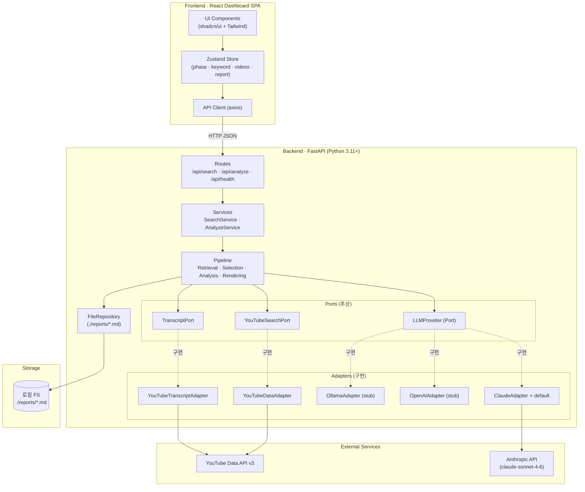
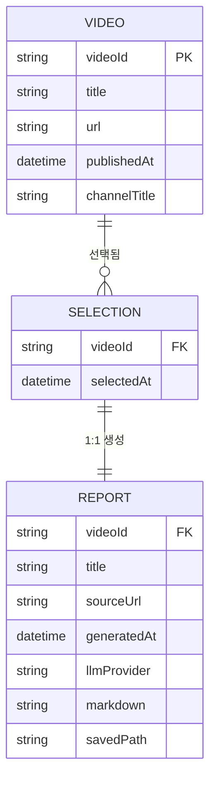
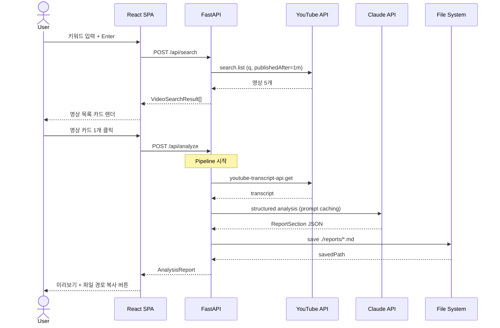

# Tech Spec: TechReport from YouTube

---

## 1. 문서 정보

| 항목 | 내용 |
|------|------|
| **작성일** | 2026-04-23 |
| **상태** | Draft |
| **버전** | v0.1 |
| **원문 PRD** | [`./prd.md`](./prd.md) v0.2 |
| **작성자** | Insang Cho (insang@hansung.ac.kr) |
| **대상 독자** | 구현 담당 개발자 / 강의 실습 학생 |

> 📝 **교육적 메모**: 이 TechSpec은 PRD의 "What/Why"를 "How"로 번역한 문서입니다. PRD → TechSpec → Issues로 이어지는 SDLC 실습 교재의 두 번째 단계입니다.

---

## 2. 시스템 아키텍처

### 2-1. 아키텍처 패턴

| 패턴 | 선택 이유 |
|------|-----------|
| **3-Tier Architecture** (Presentation / Application / Data) | 학생이 계층 경계를 눈으로 구분할 수 있어 교육적으로 가장 안전함 |
| **Pipeline Pattern** (Retrieval → Selection → Analysis → Rendering) | PRD §1의 "정보 가공 흐름"과 1:1 매핑. Separation of Concerns 실습의 교과서적 예시 |
| **Port-Adapter (Hexagonal) — LLM에 한정 적용** | LLM 공급자 교체(Provider Abstraction)를 통한 **의존성 역전 원칙(DIP)** 실습용. Claude / OpenAI / Ollama 교체 실습에 활용 |

### 2-2. 컴포넌트 구성도



> 📘 **교육 포인트**: `LLMProvider` 라는 "포트(Port)"는 추상 인터페이스이고, `ClaudeAdapter`, `OpenAIAdapter`, `OllamaAdapter`는 그 인터페이스를 만족하는 구현(Adapter)입니다. `AnalyzeService`는 포트만 의존하므로, LLM을 교체해도 상위 코드는 0줄 수정이 필요 없습니다. 이것이 **Clean Architecture**의 핵심 덕목입니다.

### 2-3. 배포 환경

| 환경 | 호스팅 | 비고 |
|------|--------|------|
| Frontend | Vite dev server (`localhost:5173`) | `pnpm dev` |
| Backend | Uvicorn ASGI (`localhost:8000`) | `uv run uvicorn app.main:app --reload` |
| Storage | 로컬 파일시스템 (`./reports/`) | DB 불필요 (YAGNI) |
| Container (선택) | Docker Compose | 재현 가능한 데모 환경 |
| CI/CD | GitHub Actions | lint / test / build — `KANBAN_TOKEN` 기반 칸반 연동 |

---

## 3. 기술 스택

### 3-1. Frontend

| 분류 | 기술 | 버전 | 선정 이유 |
|------|------|------|-----------|
| Framework | **React** | 18.3 | 대시보드 UI 표준, 학생 인지도 최고 |
| Language | **TypeScript** | 5.4 | 타입 안전성 — 교육 가치 |
| Build | **Vite** | 5.2 | 빠른 HMR, 설정 단순 |
| Styling | **Tailwind CSS** | 3.4 | 사용자 명시 요구 |
| UI Kit | **shadcn/ui** | latest | 대시보드 풍 컴포넌트 기본 제공 (Linear / Vercel 무드) |
| State | **Zustand** | 4.5 | Redux 대비 진입 장벽 낮음, 교육용 적합 |
| HTTP | **axios** | 1.7 | 에러 인터셉터 풍부 |
| Icons | **lucide-react** | latest | 엔지니어 대시보드 표준 아이콘 셋 |
| Fonts | **Inter + JetBrains Mono** | — | Grafana/Linear 계열 타이포 |
| Testing | **Vitest + Testing Library + Playwright** | — | 단위 / 통합 / E2E |

### 3-2. Backend

| 분류 | 기술 | 버전 | 선정 이유 |
|------|------|------|-----------|
| Framework | **FastAPI** | 0.111 | 자동 OpenAPI → 학생이 Swagger UI로 즉시 테스트 |
| Language | **Python** | 3.11+ | 자막 생태계 + LLM SDK + 교육 접근성 |
| ASGI Server | **Uvicorn** | 0.30 | FastAPI 기본 |
| Runtime Manager | **uv** | 0.4 | Poetry/pip 대비 빠르고 간결 — 교육 설치 부담↓ |
| DTO 검증 | **Pydantic** | 2.7 | FastAPI 일체화 |
| **LLM Default** | **anthropic-sdk-python** | 0.34 | Claude Sonnet 4.6 호출 (기본) |
| LLM Alt (stub) | openai-python, ollama-python | — | Provider 교체 실습용 |
| YouTube 검색 | **google-api-python-client** | 2.137 | 공식 Data API v3 (`publishedAfter` 지원) |
| YouTube 자막 | **youtube-transcript-api** | 0.6 | 자막 추출 사실상 표준 |
| Testing | **pytest + pytest-asyncio + httpx[mock] + respx** | — | 외부 호출 모킹 |

### 3-3. 공통 · 품질 · 자동화

| 분류 | 도구 | 목적 |
|------|------|------|
| Linter (py) | **ruff** | 린팅 + 포맷 통합 |
| Linter (ts) | **biome** | 린팅 + 포맷 통합 |
| Pre-commit | **husky + lint-staged** | 커밋 전 자동 검증 |
| Commit | **conventional commits** | 릴리즈 노트 자동화 기반 |
| CI/CD | **GitHub Actions** | `lint.yml`, `test.yml`, `e2e.yml`, `kanban.yml` |
| 테스트 환경 | **act** (로컬 GH Actions 시뮬) | 학생이 CI를 로컬에서 검증 |

---

## 4. 데이터 모델

### 4-1. 핵심 도메인 엔티티

```typescript
// shared/types.ts

export interface VideoSearchResult {
  videoId: string;           // YouTube video ID (예: "dQw4w9WgXcQ")
  title: string;
  url: string;               // https://www.youtube.com/watch?v=...
  publishedAt: string;       // ISO 8601
  channelTitle: string;
  durationSec?: number;      // (선택) 길이 정보
}

export interface VideoSelection {
  videoId: string;
  title: string;
  url: string;
  publishedAt: string;
}

export interface ReportSection {
  overview: string;          // 개요 (2~3문장)
  coreConcepts: string[];    // 핵심 개념 목록
  detailedContent: string;   // 상세 내용 (섹션별 마크다운)
  lectureTips: string;       // 강의 활용 팁
  references: string[];      // 참고 링크·타임스탬프
}

export interface AnalysisReport {
  videoId: string;
  title: string;
  sourceUrl: string;
  publishedAt: string;
  generatedAt: string;       // ISO 8601
  llmProvider: 'claude' | 'openai' | 'ollama';  // 투명성
  sections: ReportSection;
  markdown: string;          // 최종 렌더링 마크다운 전문
  savedPath: string;         // 예: ./reports/2026-04-23-openai-harness.md
}

export interface ApiEnvelope<T> {
  ok: true;
  data: T;
}

export interface ApiError {
  ok: false;
  error: { code: string; message: string; retryable: boolean };
}
```

> Python(Pydantic) 모델도 동일한 구조로 `app/schemas.py`에 정의한다.

### 4-2. 관계 다이어그램



> 💡 v1은 DB가 없으므로 위 ERD는 논리적 관계만 표현합니다. 나중에 SQLite를 도입할 때 그대로 물리 스키마로 올릴 수 있도록 설계했습니다.

---

## 5. API 명세

### 5-1. 공통 응답 포맷

```json
// 성공
{ "ok": true, "data": { /* ... */ } }

// 실패
{ "ok": false, "error": { "code": "NO_TRANSCRIPT", "message": "...", "retryable": false } }
```

### 5-2. 엔드포인트 목록

| Method | Path | 설명 | 에러 코드 |
|--------|------|------|-----------|
| `GET` | `/api/health` | 헬스 체크 | — |
| `POST` | `/api/search` | 키워드로 최근 1개월 영상 5개 검색 | `EMPTY_KEYWORD`, `NO_RESULTS`, `YOUTUBE_API_ERROR` |
| `POST` | `/api/analyze` | 선택 영상을 분석하고 보고서 저장 | `NO_TRANSCRIPT`, `LLM_TIMEOUT`, `SAVE_FAILED` |

### 5-3. 상세

#### POST `/api/search`

**Request**
```json
{ "keyword": "OpenAI Harness Engineering" }
```

**Response (200)**
```json
{
  "ok": true,
  "data": {
    "videos": [
      {
        "videoId": "abc123",
        "title": "OpenAI Harness Engineering Deep Dive",
        "url": "https://www.youtube.com/watch?v=abc123",
        "publishedAt": "2026-04-10T12:00:00Z",
        "channelTitle": "Engineering Talks"
      }
    ]
  }
}
```

**Error (400/502)**
```json
{ "ok": false, "error": { "code": "NO_RESULTS", "message": "최근 1개월 이내 관련 영상을 찾지 못했어요.", "retryable": false } }
```

#### POST `/api/analyze`

**Request**
```json
{
  "videoId": "abc123",
  "title": "OpenAI Harness Engineering Deep Dive",
  "url": "https://www.youtube.com/watch?v=abc123"
}
```

**Response (200)**
```json
{
  "ok": true,
  "data": {
    "savedPath": "./reports/2026-04-23-openai-harness-engineering-deep-dive.md",
    "markdown": "# OpenAI Harness Engineering Deep Dive\n\n## 개요\n...",
    "generatedAt": "2026-04-23T09:30:00Z",
    "llmProvider": "claude"
  }
}
```

#### GET `/api/health`

```json
{ "ok": true, "data": { "status": "up", "llmProvider": "claude", "version": "0.1.0" } }
```

---

## 6. 상세 기능 명세

### 6-1. Frontend

#### 컴포넌트 트리

```
App
├─ AppShell (dashboard layout)
│  ├─ Sidebar
│  │  ├─ BrandMark ("TechReport")
│  │  ├─ NavSection (Dashboard · History* · Settings*) // *는 v1 비활성
│  │  └─ FooterMeta (버전 · LLM Provider 배지 · 상태 도트)
│  └─ MainPanel
│     ├─ DashboardHeader (Wizard 단계바)
│     └─ WizardRouter
│        ├─ KeywordInputView         // Phase 1
│        ├─ VideoListView            // Phase 2·3 (VideoCard × 5)
│        ├─ AnalyzingView            // Phase 4 (LogStream + Progress)
│        └─ ReportResultView         // Phase 5 (MarkdownPreview + SavedPathCard)
└─ Toaster / ErrorBoundary
```

#### 상태 관리 (Zustand)

```ts
interface AppState {
  phase: 'input' | 'list' | 'analyzing' | 'result';
  keyword: string;
  videos: VideoSearchResult[];
  selectedVideo: VideoSelection | null;
  report: AnalysisReport | null;
  isLoading: boolean;
  statusLog: string[];           // "자막 가져오는 중...", "구조화 중..." 등
  error: ApiError['error'] | null;
}
```

#### 핵심 시퀀스



#### 엣지 케이스 UI

| 상황 | 처리 |
|------|------|
| 검색 결과 0건 | `<EmptyState>` + "키워드 재입력" CTA |
| 자막 없는 영상 | `<Alert variant="warning">` + "다른 영상 선택" 버튼 |
| 네트워크 오류 | `<Alert variant="destructive">` + "재시도" 버튼 (지수 백오프 정보 표시) |
| LLM 타임아웃 (30s) | 진행바 유지 + 자동 1회 재시도 후 실패 UI |

### 6-2. Backend

#### 레이어 책임

| 레이어 | 책임 | 디렉토리 |
|--------|------|----------|
| **Routes** | HTTP ↔ DTO 변환, 요청 유효성, 예외 → HTTPException 매핑 | `app/api/` |
| **Services** | 사용자 관점 오케스트레이션 (Search/Analyze) | `app/services/` |
| **Pipeline** | Retrieval · Analysis · Rendering 각 단계 | `app/pipeline/` |
| **Ports** | 추상 인터페이스 (`LLMProvider`, `YouTubeSearchPort`, `TranscriptPort`) | `app/ports/` |
| **Adapters** | 실제 외부 호출 구현 (ClaudeAdapter 외) | `app/adapters/` |
| **Repository** | 파일 저장 I/O | `app/repository/` |
| **Schemas** | Pydantic DTO | `app/schemas.py` |

#### LLM Provider 추상화 (핵심 설계)

```python
# app/ports/llm_provider.py
from abc import ABC, abstractmethod
from app.schemas import ReportSection, VideoSelection

class LLMProvider(ABC):
    """LLM 공급자 포트 — 이 인터페이스만 안정되면 구현체는 자유롭게 교체 가능."""
    
    @abstractmethod
    async def structure(
        self,
        *,
        title: str,
        transcript: str,
        system_prompt: str,
    ) -> ReportSection:
        ...

    @property
    @abstractmethod
    def name(self) -> str: ...
```

```python
# app/adapters/claude_adapter.py
import anthropic
from app.ports.llm_provider import LLMProvider

class ClaudeAdapter(LLMProvider):
    name = "claude"
    
    def __init__(self, api_key: str, model: str = "claude-sonnet-4-6"):
        self.client = anthropic.AsyncAnthropic(api_key=api_key)
        self.model = model
    
    async def structure(self, *, title, transcript, system_prompt) -> ReportSection:
        resp = await self.client.messages.create(
            model=self.model,
            max_tokens=4096,
            system=[{"type": "text", "text": system_prompt, "cache_control": {"type": "ephemeral"}}],
            messages=[{"role": "user", "content": f"제목: {title}\n\n자막:\n{transcript}"}],
        )
        return _parse_to_report_section(resp.content[0].text)
```

```python
# app/adapters/openai_adapter.py  (stub — 교육 실습용)
class OpenAIAdapter(LLMProvider):
    name = "openai"
    # TODO(학생 실습): openai SDK로 동일 계약 구현

# app/adapters/ollama_adapter.py   (stub — 교육 실습용)
class OllamaAdapter(LLMProvider):
    name = "ollama"
    # TODO(학생 실습): ollama SDK로 동일 계약 구현
```

**의존성 주입 (FastAPI Depends)**:
```python
# app/deps.py
from fastapi import Depends
from app.config import settings
from app.adapters.claude_adapter import ClaudeAdapter
from app.adapters.openai_adapter import OpenAIAdapter
from app.adapters.ollama_adapter import OllamaAdapter
from app.ports.llm_provider import LLMProvider

def get_llm_provider() -> LLMProvider:
    match settings.llm_provider:
        case "claude": return ClaudeAdapter(settings.anthropic_api_key)
        case "openai": return OpenAIAdapter(settings.openai_api_key)
        case "ollama": return OllamaAdapter(base_url=settings.ollama_base_url)
        case _: raise ValueError(f"Unknown provider: {settings.llm_provider}")
```

#### 핵심 Pipeline 구현

```python
# app/pipeline/analysis_pipeline.py
class AnalysisPipeline:
    def __init__(
        self,
        transcript_port: TranscriptPort,
        llm: LLMProvider,
        repo: FileRepository,
    ):
        self._transcript = transcript_port
        self._llm = llm
        self._repo = repo
    
    async def run(self, selection: VideoSelection) -> AnalysisReport:
        # 1. Retrieval — 자막
        transcript = await self._transcript.fetch(selection.videoId)
        if not transcript:
            raise NoTranscriptError(selection.videoId)
        
        # 2. Analysis — Claude (or any provider)
        sections = await self._llm.structure(
            title=selection.title,
            transcript=transcript,
            system_prompt=SYSTEM_PROMPT_KR,
        )
        
        # 3. Rendering
        markdown = MarkdownRenderer.render(sections, selection)
        
        # 4. Save
        saved_path = await self._repo.save(markdown, selection)
        
        return AnalysisReport(
            videoId=selection.videoId,
            title=selection.title,
            sourceUrl=selection.url,
            publishedAt=selection.publishedAt,
            generatedAt=now_iso(),
            llmProvider=self._llm.name,
            sections=sections,
            markdown=markdown,
            savedPath=saved_path,
        )
```

#### 성능 · 보안

- **Prompt Caching**: `system_prompt`는 `cache_control: ephemeral`로 캐시 → input 비용 최대 90% 절감
- **비동기 I/O**: `httpx.AsyncClient` + `asyncio.gather`로 메타·자막 병렬화
- **YouTube API 비용 방어**: `maxResults=5` 고정, 검색 결과 메모리 내 5분 캐시 (LRU)
- **API Key 격리**: 모든 외부 키는 백엔드 `.env`에만. 프론트로 전송 금지.
- **환경변수 (`.env.example`)**:
  ```dotenv
  LLM_PROVIDER=claude                     # claude | openai | ollama
  ANTHROPIC_API_KEY=sk-ant-...
  OPENAI_API_KEY=                         # (옵션 — 실습용)
  OLLAMA_BASE_URL=http://localhost:11434  # (옵션 — 실습용)
  YOUTUBE_API_KEY=AIza...
  REPORTS_DIR=./reports
  ```

---

## 7. UI/UX 스타일 가이드

### 7-1. 디자인 토큰 (Tailwind config)

```js
// tailwind.config.js
export default {
  darkMode: 'class',
  theme: {
    extend: {
      colors: {
        bg:     { DEFAULT: '#0a0a0a', subtle: '#111113', card: '#151518' },
        border: { DEFAULT: '#27272a', strong: '#3f3f46' },
        fg:     { DEFAULT: '#e4e4e7', muted: '#a1a1aa', subtle: '#71717a' },
        accent: { DEFAULT: '#22c55e' },   // emerald — 성공
        warn:   { DEFAULT: '#f59e0b' },   // amber  — 진행
        error:  { DEFAULT: '#f43f5e' },   // rose   — 실패
        info:   { DEFAULT: '#0ea5e9' },   // sky    — 정보
      },
      fontFamily: {
        sans: ['Inter', 'system-ui', 'sans-serif'],
        mono: ['JetBrains Mono', 'monospace'],
      },
      boxShadow: {
        card: '0 1px 0 0 rgba(255,255,255,0.04), 0 0 0 1px rgba(255,255,255,0.06)',
      },
    },
  },
};
```

### 7-2. 타이포그래피

| 역할 | 폰트 | 크기 | 굵기 |
|------|------|------|------|
| Display | Inter | 28px | 600 |
| H1 | Inter | 22px | 600 |
| H2 | Inter | 18px | 500 |
| Body | Inter | 14px | 400 |
| Mono/Meta | JetBrains Mono | 13px | 400 |

### 7-3. 공통 컴포넌트 사양

**shadcn/ui 기반**: `Button`, `Card`, `Badge`, `Input`, `Skeleton`, `Progress`, `ScrollArea`, `Separator`, `Alert`, `Dialog`, `Toast`

**커스텀**:
- `<StatusDot status="up | progress | error" />` — 2px 원형 LED 스타일
- `<VideoCard video={...} selected={bool} onSelect={fn} />` — hover ring, 선택 시 emerald border
- `<LogStream lines={string[]} />` — JetBrains Mono 13px 줄 단위 append, 자동 스크롤
- `<WizardStepBar currentPhase={...} />` — 5단계 원형 인디케이터 (완료/진행/대기)
- `<MarkdownPreview markdown={...} />` — `react-markdown` + `rehype-highlight` (다크 테마)

### 7-4. 레이아웃 · 반응형

- **Desktop 우선** (권장 min-width 1280px)
- **2-column layout**: 사이드바(240px) + 메인(flex-1)
- **Breakpoints**:
  - `<1024px`: 사이드바 아이콘-only 축소
  - `<768px`: 세로 스택 (v1에서는 "권장 해상도 이상" 정책 — 학생 데모 환경 기준)

### 7-5. 접근성 (A11y)

- 모든 상태는 **색상 + 아이콘 + 텍스트** 3중 표시 (색맹 배려)
- 키보드 네비게이션 (Tab / Enter / Esc / `/` — 검색 포커스)
- `aria-live="polite"` 영역에서 분석 진행 로그 음성 안내
- 다크 모드에서도 WCAG AA 이상 대비율 확보

---

## 8. 개발 마일스톤

> 📅 누적 8일 일정. 각 Phase는 GitHub Flow로 PR 단위 머지.

### Phase 1 — 기반 구축 (Day 1) ▷ _Layer 0: CI 부트스트랩_

- [ ] monorepo 초기화 (`/frontend`, `/backend`)
- [ ] `pnpm create vite` + Tailwind + shadcn/ui 초기화
- [ ] `uv init` + FastAPI 뼈대
- [ ] `.env.example`, `.gitignore`, `README.md`
- [ ] GitHub Actions `lint.yml`, `test.yml` (빈 테스트라도 green)
- [ ] `KANBAN_TOKEN` runtime-guard 워크플로우 (미등록 시 graceful skip)
- [ ] 다크 테마 토큰 적용

### Phase 2 — Walking Skeleton (Day 2) ▷ _Layer 2: CD 스켈레톤_

- [ ] `/api/health` 구현 + `ClaudeAdapter` 연결 확인
- [ ] 프론트 `AppShell` + `Hello Dashboard` 화면
- [ ] E2E 1건 (Playwright: "Dashboard가 떠서 /health 상태가 표시된다")
- [ ] GitHub Actions `e2e.yml` (staging profile)

### Phase 3 — 핵심 기능 구현 (Day 3~7)

- [ ] **Day 3**: `YouTubeSearchPort` + `YouTubeDataAdapter` + `/api/search` + `KeywordInputView` + `VideoListView`
- [ ] **Day 4**: `TranscriptPort` + `YouTubeTranscriptAdapter` + `AnalyzingView` UI
- [ ] **Day 5**: `LLMProvider` (Claude 기본) + `AnalysisPipeline` + 프롬프트 튜닝
- [ ] **Day 6**: `MarkdownRenderer` + `FileRepository` + `ReportResultView`
- [ ] **Day 7**: 에러·엣지 케이스 UI + `statusLog` 스트리밍

### Phase 4 — 안정화 · 데모 준비 (Day 8)

- [ ] Playwright E2E 시나리오 3건 (성공 / 자막 없음 / 검색 0건)
- [ ] 프롬프트 캐싱 튜닝 + 비용 계측 로그
- [ ] `OpenAIAdapter`·`OllamaAdapter` 스텁 추가 (학생 실습용 TODO 포함)
- [ ] README 업데이트 (설치·실행·교체 실습 섹션)
- [ ] 릴리즈 v0.1.0 태그

---

## 부록

### A. 용어 정의

| 용어 | 의미 |
|------|------|
| **TechReport** | 본 도구가 생성하는 한국어 기술보고서 마크다운 파일 |
| **Pipeline** | Retrieval → Selection → Analysis → Rendering의 4단계 정보 가공 흐름 |
| **Port** | 외부 의존성을 추상화한 인터페이스 (헥사고날 아키텍처 용어) |
| **Adapter** | Port 인터페이스를 구현한 실제 외부 호출 코드 |
| **Walking Skeleton** | End-to-End로 최소 동작하는 최초 베이스라인 (Alistair Cockburn) |

### B. 미결 사항 (Open Questions)

| ID | 질문 | 현재 방향 |
|----|------|-----------|
| Q1 | 보고서 파일명 슬러그 — 영상 제목 vs. videoId? | **영상 제목 기반 slugify** (특수문자 제거, 길이 50자 제한). 충돌 시 suffix `-{videoId}`. |
| Q2 | LLM 응답을 JSON으로 받을지, 마크다운으로 받을지 | **JSON (`ReportSection`)** 으로 받고, 렌더러가 마크다운 변환 → 검증·테스트 용이 |
| Q3 | 외부 호출 모킹 전략 | `respx` + `pytest-anyio`로 HTTP 레벨 모킹 |
| Q4 | 다국어 출력(영문 보고서) 지원 시점 | **v2 이후**. v1은 PRD에 따라 한국어 고정 |
| Q5 | Claude 비용 모니터링 | `/api/health`에 월간 누적 토큰 카운터 (v1.1 에서) |

### C. 변경 이력

| 날짜 | 버전 | 변경 내용 |
|------|------|-----------|
| 2026-04-23 | v0.1 | 최초 작성. PRD §7 환경을 "로컬 웹 대시보드"로 동기화. LLM Provider 추상화 채택. |

---

> 📌 본 TechSpec은 `sdlc-skill-pack:write-techspec` 스킬로 작성되었습니다. 다음 단계는 **이슈 분할**입니다.
>
> - **수직 슬라이스 (Walking Skeleton + Vertical Slice)** 방식 → `sdlc-skill-pack:generate-issues-vertical`
> - **아키텍처 계층별** 방식 → `sdlc-skill-pack:generate-issues-layered`
>
> 교육 데모 용도에는 **Vertical Slice**가 End-to-End 완성품을 계속 유지하는 특성상 데모 시연에 유리합니다.
